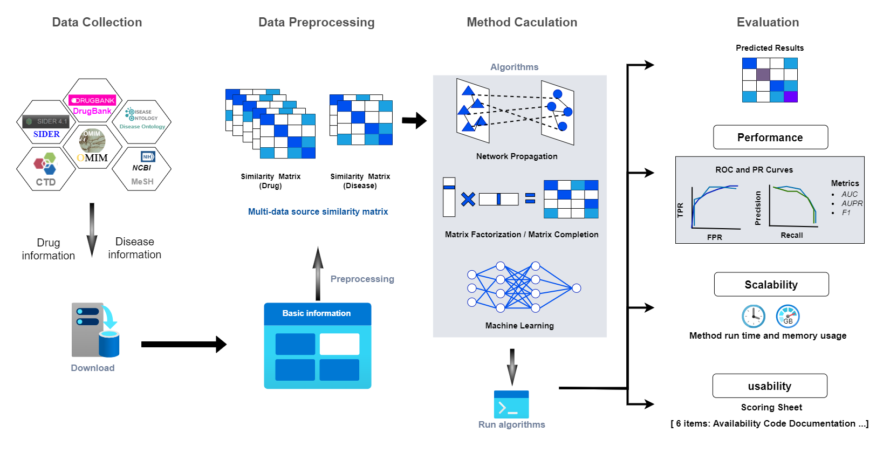

# HN-DRES: a repository for heterogeneous network-based drug repositioning method evaluation snakemake workflow.

## Web APP
Detailed evaluation results and web prediction tools (HN-DREP) are available at: [http://hn-drep.lyhbio.com](http://hn-drep.lyhbio.com).  
The source code of this web app can be found at [https://github.com/lyhbio/HN-DREP/tree/master](https://github.com/lyhbio/HN-DREP/tree/master).
## Requirements
- Python=3.6
- scikit-learn=0.24.2
- snakemake=6.15.5
- Matlab 2020a  

## Installation
Download by
~~~~
git clone https://github.com/lyhbio/HN-DRES.git
~~~~
and install dependencies by
~~~~~
conda env create -f environment.yaml
~~~~~

## File Structure Tree for the Project
Click the 'file tree' button to expand or collapse the file tree, presenting a hierarchical view of the directory's files and folders, facilitating easy content navigation.
<details>
  <summary>file tree</summary>

```plaintext
HN-DRES-main
├── environment.yaml
├── figures
│   ├── auc_aupr_f1_1.png
│   ├── overall_1.png
│   ├── overflow-final-v2.drawio.png
│   ├── README.md
│   ├── Scalability_usability_human_1.png
│   ├── Scalability.png
│   └── Usability.png
├── LICENSE
├── README.md
├── Snakefile
└── Snakemake
    ├── auc.py
    ├── aupr.py
    ├── BNNR
    │   ├── BNNR.m
    │   ├── crossval_method.m
    │   ├── Datasets
    │   │   ├── Cdataset.mat
    │   │   ├── deepDR.mat
    │   │   ├── DNdataset.mat
    │   │   ├── Fdataset.mat
    │   │   ├── HDVD.mat
    │   │   ├── LAGCN.mat
    │   │   ├── LRSSL.mat
    │   │   ├── SCMFDD_L.mat
    │   │   └── Ydataset.mat
    │   ├── Demo.m
    │   ├── method_pre.m
    │   ├── README.md
    │   ├── svt.m
    │   └── train_test_split.m
    ├── dag_evaluate.png
    ├── dag_pre.png
    ├── environment.yaml
    ├── Evaluation
    │   ├── Benchmark
    │   │   ├── benchmark_BNNR_Fdataset.txt
    │   │   ├── benchmark_HGIMC_Fdataset.txt
    │   │   ├── CV_BNNR_Fdataset.txt
    │   │   ├── CV_HGIMC_Fdataset.txt
    │   │   ├── evaluate_BNNR_Fdataset.txt
    │   │   └── evaluate_HGIMC_Fdataset.txt
    │   ├── BNNR
    │   │   └── Fdataset
    │   │       ├── final_CV_folds.csv
    │   │       ├── origin10.csv
    │   │       ├── origin1.csv
    │   │       ├── origin2.csv
    │   │       ├── origin3.csv
    │   │       ├── origin4.csv
    │   │       ├── origin5.csv
    │   │       ├── origin6.csv
    │   │       ├── origin7.csv
    │   │       ├── origin8.csv
    │   │       ├── origin9.csv
    │   │       ├── Plot
    │   │       │   ├── BNNR_Fdataset_auc.png
    │   │       │   ├── BNNR_Fdataset_aupr.png
    │   │       │   ├── BNNR_Fdataset_mean_auc.png
    │   │       │   └── BNNR_Fdataset_mean_aupr.png
    │   │       ├── pre10.csv
    │   │       ├── pre1.csv
    │   │       ├── pre2.csv
    │   │       ├── pre3.csv
    │   │       ├── pre4.csv
    │   │       ├── pre5.csv
    │   │       ├── pre6.csv
    │   │       ├── pre7.csv
    │   │       ├── pre8.csv
    │   │       └── pre9.csv
    │   ├── BNNR_Fdataset.csv
    │   ├── HGIMC
    │   │   └── Fdataset
    │   │       ├── final_CV_folds.csv
    │   │       ├── origin10.csv
    │   │       ├── origin1.csv
    │   │       ├── origin2.csv
    │   │       ├── origin3.csv
    │   │       ├── origin4.csv
    │   │       ├── origin5.csv
    │   │       ├── origin6.csv
    │   │       ├── origin7.csv
    │   │       ├── origin8.csv
    │   │       ├── origin9.csv
    │   │       ├── Plot
    │   │       │   ├── HGIMC_Fdataset_auc.png
    │   │       │   ├── HGIMC_Fdataset_aupr.png
    │   │       │   ├── HGIMC_Fdataset_mean_auc.png
    │   │       │   └── HGIMC_Fdataset_mean_aupr.png
    │   │       ├── pre10.csv
    │   │       ├── pre1.csv
    │   │       ├── pre2.csv
    │   │       ├── pre3.csv
    │   │       ├── pre4.csv
    │   │       ├── pre5.csv
    │   │       ├── pre6.csv
    │   │       ├── pre7.csv
    │   │       ├── pre8.csv
    │   │       └── pre9.csv
    │   ├── HGIMC_Fdataset.csv
    │   └── log
    │       ├── benchmark_BNNR_Fdataset.log
    │       ├── benchmark_HGIMC_Fdataset.log
    │       ├── CV_BNNR_Fdataset.log
    │       ├── CV_HGIMC_Fdataset.log
    │       ├── evaluate_BNNR_Fdataset.log
    │       └── evaluate_HGIMC_Fdataset.log
    ├── F1.py
    ├── HGIMC
    │   ├── crossval_method.m
    │   ├── Datasets
    │   │   ├── Cdataset.mat
    │   │   ├── Datasets description.txt
    │   │   ├── Fdataset.mat
    │   │   └── Ydataset.mat
    │   ├── Demo_HGIMC.m
    │   ├── Functions
    │   │   ├── fBMC.m
    │   │   ├── fGRB.m
    │   │   ├── fHGI.m
    │   │   ├── fNorm.m
    │   │   └── svt.m
    │   ├── HGIMC_pre.m
    │   ├── HGIMC_V1.m
    │   ├── method_pre.m
    │   ├── README.md
    │   └── train_test_split.m
    ├── origin-pre_2_final.py
    ├── README.md
    └── Snakefile

16 directories, 116 files
```
</details>  

## Usage
Go to the Snakemake folder
~~~~
cd Snakemake
~~~~
If you only want to get the prediction results and scalability (time and memory peak consumption) of the method on the specified dataset, run the command(rule run_method_pre):
~~~~
snakemake -j 1 {outdir}/{method}_{dataset}.csv
~~~~
Example : BNNR method on Fdataset  
Command : `snakemake -j 1 Evaluation/BNNR_Fdataset.csv`  
Following the completion of the run, you'll discover the prediction results within the Evaluation folder. Additionally, you can access logs detailing time and memory consumption in their respective Benchmark and Log folders.
  
If you want to get the full results of the method on the specified dataset, including prediction results, scalability,performance,auc curve and aupr curve,run the command(rule evaluate): 
~~~~
snakemake -j 1 {outdir}/{method}/{dataset}/Plot/{method}_{dataset}_auc.png
~~~~
or
~~~~
snakemake -j 1 {outdir}/{method}/{dataset}/Plot/{method}_{dataset}_aupr.png  
~~~~
Example : BNNR method on Cdataset  
Command : `snakemake -j 1 Evaluation/BNNR/Cdataset/Plot/BNNR_Cdataset_auc.png`  
After completing the run, you can locate comprehensive results in the Evaluation folder. This encompasses prediction results, AUC curves, and AUPR curves found in the Plot folder, as well as AUC, AUPR, and F1 values stored in either the Benchmark folder or the Log folder.  

Users can add the command line parameter `--use-conda`, and snakemake will automatically create a running environment.
## Datasets [](https://zenodo.org/record/8357512)
The following datasets were used in our study：
`Fdataset`, `Cdataset`, `Ydataset`, `DNdataset`, `HDVD`, `LAGCN`, `LRSSL`, `SCMFDD_L`, `deepDR`, `iDrug`, `TLHGBI`, which is available at: [https://zenodo.org/record/8357512](https://zenodo.org/record/8357512).

## Adding new methods (bring your own method to the benchmark)
If you wish to incorporate a new method into the process, simply follow these steps:  
1. Place the method folder in the `Snakemake` directory.
2. Store the corresponding dataset in the Datasets folder.
3. Utilize `method_pre.m` and `crossval_method.m` as templates to adapt the `1. import data code` and `2. algorithmic code` sections according to your specific requirements, replacing them as needed.

If the method has already been crossvalidated, you just need to place the csv file results under the corresponding folder of the method, convert it to the final_CV_folds.csv file using the `originate-pre_2_final.py` script, and then run the Snakefile's evaluate rule.
  
If your method is not written in matlab, you should replace the `< >` placeholders in the Snakefile's `run_method_prerule` and `generate_CV_folds` rule shell with your own run script and make the necessary adjustments to your code accordingly. The `evaluate` rule  do not need to be modified.
~~~~
rule run_method_pre:
    input:
        "{method}/Datasets/{dataset}.mat"
    output:
        "{outdir}/{method}_{dataset}.csv"
    conda:
        "environment.yaml"
    log:
        "{outdir}/log/benchmark_{method}_{dataset}.log"
    benchmark:
        "{outdir}/Benchmark/benchmark_{method}_{dataset}.txt"
    shell:
        """
        # Run and record execution time and memory usage to the log file.
        (cd {wildcards.method} &&
        /usr/bin/time -f "\nExecution Time: %E\nPeak Memory Usage: %M KB" <your run script> 2>&1 | tee {log}  ## modify the script and adjust your code appropriately
        """

rule generate_CV_folds:
    input:
        "{outdir}/{method}_{dataset}.csv",
        "{method}/Datasets/{dataset}.mat"
    output:
        "{outdir}/{method}/{dataset}/final_CV_folds.csv"
    conda:
        "environment.yaml"
    log:
        "{outdir}/log/CV_{method}_{dataset}.log"
    benchmark:
        "{outdir}/Benchmark/CV_{method}_{dataset}.txt"
    shell:
        """
        # Run script and generate cross-validation fold data.
        (cd {wildcards.method} &&   
        <your script> &&      ## modify the script and adjust your code appropriately
        cd .. &&
        python origin-pre_2_final.py --file_path="{wildcards.outdir}/{wildcards.method}/{wildcards.dataset}" )  2>&1 | tee {log}
        """
~~~~

## License
[](https://opensource.org/licenses/MIT)
Copyright (c) 2023 yinqi yang


